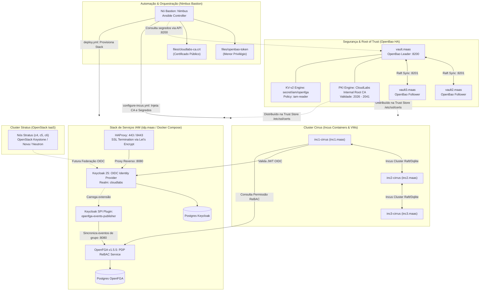

# Documentação da Infraestrutura IAM (Keycloak, OpenFGA, OpenBao, Incus & CI/CD)

Bem-vindo à documentação técnica detalhada das alterações, correções e arquitetura da infraestrutura de Identidade e Acesso (IAM) do **CloudLabs - UFSCar**.

Este conjunto de documentos consolida todo o processo de auditoria, sincronização de Infrastructure as Code (IaC), correções de bugs, segurança de credenciais, autoridade de certificação interna (PKI Root CA) e automação de deploy contínuo realizado no repositório [`Auth-repo`](https://github.com/cloudlabs-ufscar/Auth-repo).

---

## 🗺️ Índice da Documentação

A documentação está dividida em 5 módulos estruturados:

1. [**Arquitetura Geral do Sistema**](architecture-overview.md)
   * Visão sistêmica dos componentes (`Keycloak`, `OpenFGA`, `OpenBao`, `HAProxy`, `PostgreSQL`, `Incus`, `Nimbus`).
   * Fluxos de autenticação OIDC (Web UI e CLI via Device Code Grant).
   * Modelo de controle de acesso baseado em relacionamentos (ReBAC).
   * Segmentação computacional: **Cirrus** (Incus) e **Stratus** (OpenStack).

2. [**Integração Keycloak e OpenFGA**](keycloak-openfga-integration.md)
   * Estrutura dos 18 grupos planos vs. grupos aninhados (justificativa técnica detalhada).
   * Configuração dos clients `incus-cirrus` e fluxos de autenticação.
   * Funcionamento do plugin SPI `keycloak-openfga-event-publisher`.
   * Mapeamento de tuplas e isolamento por projeto no OpenFGA.

3. [**Pipeline CI/CD e Automação Ansible**](cicd-and-deployment.md)
   * Workflow do GitHub Actions (`.github/workflows/deploy.yml`).
   * Fluxo de conexão SSH com o nó bastion (Nimbus) e máquina alvo (`idp.maas`).
   * Injeção dinâmica de segredos (`KEYCLOAK_GITHUB_CLIENT_ID` e `SECRET`).
   * Estrutura do playbook Ansible e idempotência.

4. [**Troubleshooting e Análise de Falhas Resolvidas**](troubleshooting-and-postmortems.md)
   * *Postmortem 1*: Loop de reinício no container `migrate` e timeout no Docker Compose.
   * *Postmortem 2*: Erro de chave pública SSH (`root@200.18.99.87: Permission denied`).
   * *Postmortem 3*: Restrição de nomes de secrets no GitHub Actions (`GITHUB_*`).
   * *Postmortem 4*: Identificação de usuários no Incus (`oidc.claim`: `email` vs. `preferred_username` vs. `sub`).

5. [**Gestão Centralizada de Segredos & PKI com OpenBao**](openbao-secrets-management.md)
   * Cluster de Alta Disponibilidade (HA) de 3 nós com Raft Storage (`vault.maas`, `vault2.maas`, `vault3.maas`).
   * Padrão de implantação *air-gapped* via Ansible e pacote nativo `.deb`.
   * Inicialização Shamir e serviço de auto-unseal no systemd em todos os membros.
   * Root of Trust: Engine PKI habilitada e emissão da `CloudLabs Internal Root CA` (validade 2026-2041).
   * Política de Menor Privilégio (`iam-reader`) para leitura de credenciais do OpenFGA.
   * Integração dinâmica com o cluster Incus (Cirrus), eliminando credenciais em texto plano.

6. [**Federação GitHub, Onboarding e Autenticação Híbrida**](github-federation-and-onboarding.md)
   * Onboarding com gatekeeper: validação de elegibilidade na organização `cloudlabs-ufscar`.
   * Criação e persistência do usuário no banco local do Keycloak com senha obrigatória (`UPDATE_PASSWORD`).
   * Autonomia operacional: login rotineiro local independente de serviços externos.
   * Especificação do plugin SPI `keycloak-github-org-validator`.

7. [**Fluxo Detalhado de Autenticação (Diagrama Sequencial e Interativo)**](fluxo-autenticacao.md)
   * Detalhamento requisição a requisição: fases 1 a 4, 19 passos HTTP com payloads, query params, tokens e cookies.
   * [**Versão Interativa (.html)**](fluxo-autenticacao.html): Diagrama Mermaid standalone para visualização direta no navegador (com renderizador automático, dark mode e zoom).

---

## 🏗️ Visão Geral da Arquitetura

O diagrama abaixo ilustra como os componentes do repositório interagem entre si, com a autoridade de segredos e com os clusters computacionais do laboratório:

---

## 📌 Resumo dos Arquivos Modificados no Repositório

| Arquivo | Mudança Principal |
| :--- | :--- |
| [`.github/workflows/deploy.yml`](../../.github/workflows/deploy.yml) | Automação completa de deploy via SSH, clone automático, injeção de segredos e timeout de 20m. |
| [`scripts/ansible-iam/inventory/inventory`](../../scripts/ansible-iam/inventory/inventory) | Grupo `[vault]` configurado com o cluster de 3 nós: `vault.maas`, `vault2.maas` e `vault3.maas`. |
| [`scripts/ansible-iam/tasks/deploy-openbao.yml`](../../scripts/ansible-iam/tasks/deploy-openbao.yml) | Playbook de deploy automatizado do cluster OpenBao HA em padrão air-gapped. |
| [`scripts/ansible-iam/roles/openbao/`](../../scripts/ansible-iam/roles/openbao/) | Role completa: instalação `.deb`, template Raft `openbao.hcl`, inicialização Shamir, Raft Join e auto-unseal systemd. |
| [`scripts/ansible-iam/roles/deploy/tasks/fetch-secrets.yml`](../../scripts/ansible-iam/roles/deploy/tasks/fetch-secrets.yml) | Leitura dinâmica e segura de credenciais do cluster OpenBao Raft HA em tempo de execução via token `iam-reader`. |
| [`scripts/ansible-iam/roles/deploy/files/schema-keycloak.json`](../../scripts/ansible-iam/roles/deploy/files/schema-keycloak.json) | 18 grupos planos, client `incus-cirrus` público com Device Flow, segredos parametrizados. |
| [`scripts/ansible-iam/roles/deploy/files/schema-openfga-1.json`](../../scripts/ansible-iam/roles/deploy/files/schema-openfga-1.json) | Tupla administrativa `group:admin-project-admin#member -> server:incus` e mapeamentos por projeto. |
| [`scripts/ansible-iam/roles/deploy/templates/docker-compose.yml.j2`](../../scripts/ansible-iam/roles/deploy/templates/docker-compose.yml.j2) | Correção de healthcheck, remoção de restart loop do `migrate`, injeção dinâmica de segredos via OpenBao. |
| [`scripts/ansible-iam/roles/deploy/defaults/main.yml`](../../scripts/ansible-iam/roles/deploy/defaults/main.yml) | Fallbacks seguros `github_client_id: ""` e `github_client_secret: ""`. |
| [`github-federation-and-onboarding.md`](github-federation-and-onboarding.md) | Documentação completa do fluxo de onboarding com validação de org GitHub e SPI. |
| [`fluxo-autenticacao.md`](fluxo-autenticacao.md) | Detalhamento técnico requisição a requisição com tabelas e diagrama Mermaid. |
| [`fluxo-autenticacao.html`](fluxo-autenticacao.html) | Página HTML standalone com Mermaid interativo (dark theme, pan/zoom) para visualização offline. |
