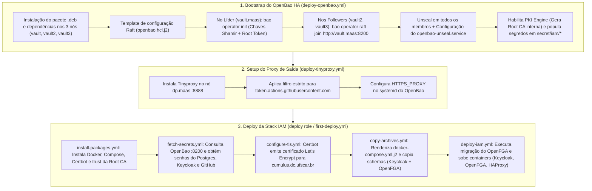
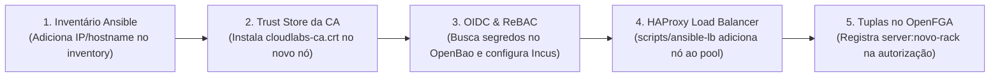

# 🛠️ Automação Ansible: Bootstrap Inicial (Day 0) e Expansão de Servidores / Racks (Day 2)

Este documento consolida o ciclo de vida completo de automação gerenciado via Ansible no laboratório **CloudLabs - UFSCar**:
1. **Bootstrap Inicial (Day 0):** Como o Ansible provisiona a infraestrutura do zero quando os servidores estão recém-formatados.
2. **Expansão de Infraestrutura (Day 2 / Scale-Out):** O fluxo técnico passo a passo executado ao adicionar uma nova máquina física, nó de computação ou rack de servidores ao datacenter.

---

## 1. Visão Geral dos Playbooks e Roles

A automação está organizada em dois módulos principais sob o diretório [`scripts/`](../../scripts/):

* **[`scripts/ansible-iam/`](../../scripts/ansible-iam/):**
  * `tasks/deploy-openbao.yml`: Implantação do cluster OpenBao HA (Raft storage, unseal Shamir, Root CA interna).
  * `tasks/deploy-tinyproxy.yml`: Implantação do proxy de saída com whitelist para o OpenBao no nó IAM.
  * `tasks/first-deploy.yml` (e role `deploy`): Provisionamento completo da stack Docker (Keycloak, OpenFGA, Postgres, HAProxy).
  * `tasks/configure-openbao-proxy-oidc.yml`: Configuração do motor JWT/OIDC no OpenBao.
* **[`scripts/ansible-lb/`](../../scripts/ansible-lb/):**
  * Gerenciamento e balanceamento dos clusters computacionais (Incus/Cirrus e OpenStack/Stratus) via HAProxy externo.

---

## 2. Fluxo 1: Bootstrap Inicial (Day 0 — Setup do Zero)

Quando a infraestrutura está limpa (servidores recém-provisionados via MAAS), a execução segue uma **ordem estrita de dependências**:



### Detalhamento das Tarefas de Bootstrap:

#### Passo 1: OpenBao HA & PKI Root of Trust
```bash
ansible-playbook -i inventory/inventory tasks/deploy-openbao.yml
```
1. Cria os usuários de sistema `openbao:openbao` e pastas `/var/lib/openbao/data` com permissão restrita `0700`.
2. No nó primário (`vault.maas`), roda `bao operator init -key-shares=1 -key-threshold=1 -format=json`.
3. Nos nós secundários (`vault2.maas`, `vault3.maas`), une os membros ao quórum distribuído via `bao operator raft join`.
4. Salva a chave de desbloqueio em `/var/lib/openbao/data/unseal.key` e inicializa o serviço systemd de auto-unseal.
5. Inicializa a engine PKI interna e exporta o certificado público [`cloudlabs-ca.crt`](openbao-secrets-management.md).
6. Cria a política `iam-reader` e grava as credenciais de banco e chaves de API em `secret/data/iam/`.

#### Passo 2: Egress Proxy no IAM
```bash
ansible-playbook -i inventory/inventory tasks/deploy-tinyproxy.yml
```
1. Sobe o daemon `tinyproxy` na porta `8888` de `idp.maas`.
2. Garante que os nós do OpenBao alcancem as chaves JWKS do GitHub Actions sem expor a rede privada à internet.

#### Passo 3: Stack de Serviços IAM
```bash
ansible-playbook -i inventory/inventory tasks/first-deploy.yml
```
1. **`install-packages.yml`:** Instala pacotes base e copia a `cloudlabs-ca.crt` para `/usr/local/share/ca-certificates/`, executando `update-ca-certificates`.
2. **`fetch-secrets.yml`:** Lê em tempo de execução via REST API (`http://vault.maas:8200/v1/secret/data/iam/*`) todas as senhas necessárias.
3. **`configure-tls.yml`:** Executa o Certbot standalone para obter o certificado SSL/TLS de `cumulus.dc.ufscar.br` e compila o arquivo `/etc/ssl/private/haproxy/haproxy.pem` com `chmod 0644`.
4. **`copy-archives.yml`:** Transfere os schemas ([`schema-keycloak.json`](../../scripts/ansible-iam/roles/deploy/files/schema-keycloak.json), [`schema-openfga-1.json`](../../scripts/ansible-iam/roles/deploy/files/schema-openfga-1.json)) e os plugins SPI (`keycloak-github-org-validator.jar` e `keycloak-openfga-event-publisher.jar`).
5. **`deploy-iam.yml`:** Inicia os containers. O serviço `migrate` inicializa as tabelas do OpenFGA e o Keycloak importa automaticamente o realm `cloudlabs` com os 18 grupos planos e o fluxo híbrido GitHub.

---

## 3. Fluxo 2: Expansão de Servidores e Novos Racks (Day 2 / Scale-Out)

Quando um rack novo ou novo nó de computação (como nós bare-metal do Incus/Cirrus ou computação do OpenStack/Stratus) chega ao laboratório, o fluxo de integração ocorre em 5 etapas padronizadas:



### 1. Adicionar o Host no Inventário
No arquivo [`scripts/ansible-iam/inventory/inventory`](../../scripts/ansible-iam/inventory/inventory) (ou inventário do cluster):
```ini
[cirrus]
inc1-cirrus.maas
inc2-cirrus.maas
inc3-cirrus.maas
inc4-cirrus.maas   # <-- Novo nó no rack recém-instalado
```

### 2. Instalar a Root CA do CloudLabs no Novo Servidor
Para que o novo servidor confie na comunicação TLS local (sem rejeitar certificados internos):
```yaml
- name: Distribute CloudLabs Internal Root CA
  ansible.builtin.copy:
    src: cloudlabs-ca.crt
    dest: /usr/local/share/ca-certificates/cloudlabs-ca.crt
    mode: '0644'
  notify: update-ca-certificates
```

### 3. Configurar Autenticação OIDC e Autorização ReBAC (`configure-incus.yml`)
O Ansible consulta o OpenBao dinamicamente e injeta as diretivas no daemon do Incus:
```yaml
- name: Configure Incus OIDC and OpenFGA via OpenBao
  block:
    - name: Fetch OpenFGA credentials from OpenBao
      ansible.builtin.uri:
        url: "http://vault.maas:8200/v1/secret/data/iam/openfga"
        headers:
          X-Vault-Token: "{{ openbao_token }}"
      register: openfga_secrets

    - name: Apply OIDC and OpenFGA configuration to Incus
      ansible.builtin.command: "{{ item }}"
      loop:
        - incus config set oidc.issuer https://cumulus.dc.ufscar.br:8443/realms/cloudlabs
        - incus config set oidc.client.id incus-cirrus
        - incus config set authorization.openfga.api.token {{ openfga_secrets.json.data.data.api_token }}
        - incus config set authorization.openfga.store.id {{ openfga_secrets.json.data.data.store_id }}
```

### 4. Atualizar o Balanceador de Carga ([`ansible-lb`](../../scripts/ansible-lb/))
No template do balanceador ([`scripts/ansible-lb/roles/deploy/templates/haproxy.cfg.j2`](../../scripts/ansible-lb/roles/deploy/templates/haproxy.cfg.j2)), adicione o IP do novo servidor à lista:
```yaml
incus_clusters:
  - name: cirrus
    port: 8443
    ips:
      - 192.168.69.10  # inc1
      - 192.168.69.11  # inc2
      - 192.168.69.12  # inc3
      - 192.168.69.13  # inc4 (novo servidor)
```
Ao executar a role `ansible-lb`, o HAProxy efetua um reload suave (`docker kill -s HUP haproxy`), distribuindo imediatamente conexões para a nova máquina sem downtime.

### 5. Cadastrar as Tuplas de Acesso no OpenFGA
Caso o novo rack/servidor seja segregado por projeto, adicione a relação correspondente no OpenFGA:
```json
{
  "user": "group:admin-project-admin#member",
  "relation": "admin",
  "object": "server:inc4-cirrus"
}
```

---

## 4. Scale-Out do Cluster OpenBao HA (Novo Nó no Cofre)

Se a expansão envolver adicionar uma nova máquina ao próprio cluster de alta disponibilidade do OpenBao (por exemplo, `vault4.maas`):

1. **Adicionar ao Inventário:**
   ```ini
   [vault]
   vault.maas
   vault2.maas
   vault3.maas
   vault4.maas   # <-- Novo nó
   ```
2. **Executar a Role `openbao`:**
   O Ansible instala o `.deb`, gera o `openbao.hcl` com `cluster_addr` apontando para o IP do novo nó e executa o comando Raft Join:
   ```bash
   bao operator raft join http://vault.maas:8200
   ```
3. **Unseal:**
   O script `openbao-unseal.sh` aplica a chave Shamir já existente. O nó sincroniza instantaneamente todo o histórico de segredos via log do Raft e passa a responder como membro Standby do cluster.

---

## 5. Cheat Sheet de Comandos de Operação

| Ação | Comando Ansible |
| :--- | :--- |
| **Setup inicial do OpenBao** | `ansible-playbook -i inventory/inventory tasks/deploy-openbao.yml` |
| **Setup inicial do Tinyproxy** | `ansible-playbook -i inventory/inventory tasks/deploy-tinyproxy.yml` |
| **Setup inicial da Stack IAM** | `ansible-playbook -i inventory/inventory tasks/first-deploy.yml` |
| **Deploy contínuo rotineiro (CI/CD)** | Automático via GitHub Actions (`.github/workflows/deploy.yml`) |
| **Atualização do balanceador de carga** | `ansible-playbook -i inventory/inventory playbooks/deploy-lb.yml` |
| **Verificar saúde do cluster OpenBao** | `bao operator raft list-peers` |
