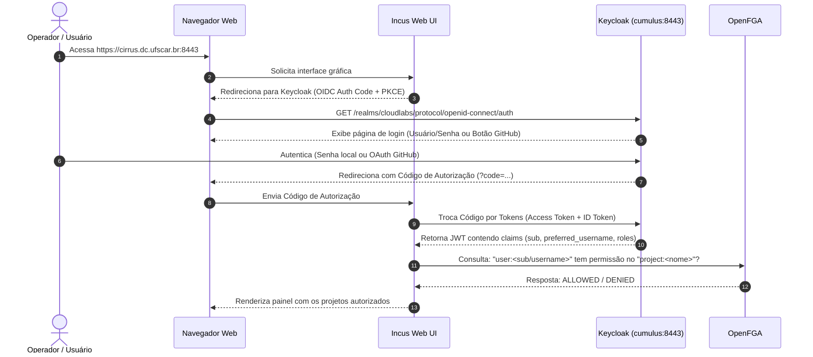
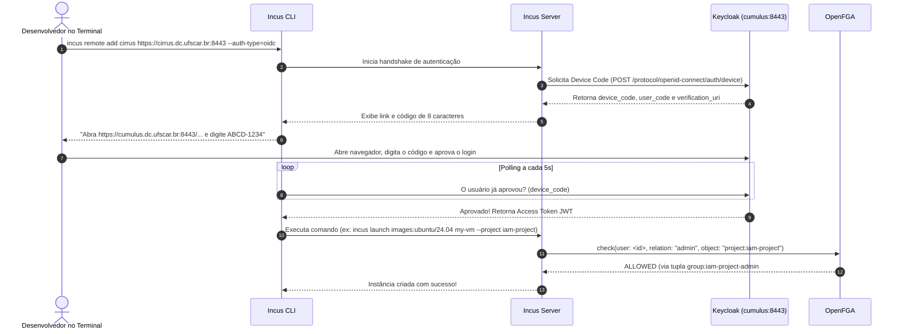

# Arquitetura Geral do Sistema IAM

Este documento descreve a topologia, os componentes e os fluxos de autenticação, autorização e gerenciamento de segredos que compõem a infraestrutura de Identidade e Acesso (IAM) do **CloudLabs UFSCar**.

---

## 1. Visão dos Componentes

A infraestrutura é distribuída entre serviços conteinerizados no servidor de IAM (`cumulus.dc.ufscar.br` / `idp.maas` / `200.18.99.87`), o cluster de segredos e autoridade de certificação **OpenBao HA** (`vault.maas`, `vault2.maas`, `vault3.maas`), o nó bastion de orquestração (`nimbus.dc.ufscar.br:2002`) e os clusters computacionais **Cirrus** (Incus) e **Stratus** (OpenStack).

### A. Keycloak (Provedor de Identidade - IdP)
* **Versão:** `quay.io/keycloak/keycloak:25.0.1` (Quarkus-based).
* **Função:** Ponto central de autenticação e federação de identidades.
* **Realm Principal:** `cloudlabs`.
* **Mecanismos de Login Suportados:**
  1. **Nativo:** Usuário e senha armazenados no banco local (`postgres-keycloak`).
  2. **Federado (Social):** Provedor de identidade externo via **GitHub OAuth**, utilizando escopos `openid user:email read:org`.
* **Estratégia de Inicialização:** Executado com `--import-realm`. No Keycloak, a flag de importação usa internamente a estratégia `IGNORE_EXISTING`, o que significa que o arquivo `realm.json` só é consumido na criação de um banco virgem; reboots subsequentes preservam integralmente senhas, sessões e usuários existentes no PostgreSQL.

### B. OpenFGA (Provedor de Autorização - PDP)
* **Versão:** `openfga/openfga:v1.5.5`.
* **Função:** Mecanismo de autorização fina baseado em relacionamentos (ReBAC - Relationship-Based Access Control), derivado do Google Zanzibar.
* **Banco de Dados:** PostgreSQL dedicado (`postgres-openfga:5432`).
* **Endpoints:**
  * Porta `8080` / `8081`: API HTTP / REST e gRPC.
  * Porta `3000`: Playground / Dashboard administrativo.
* **Autenticação:** Integrado via token compartilhado seguro gerido dinamicamente pelo OpenBao.

### C. Plugin SPI `keycloak-openfga-event-publisher`
* **Localização no container:** `/opt/keycloak/providers/keycloak-openfga-event-publisher.jar`.
* **Função:** Captura eventos administrativos do Keycloak (especificamente `GROUP_MEMBERSHIP`) e traduz instantaneamente para tuplas no OpenFGA através da API HTTP do OpenFGA.
* **Regra de Tradução:** Quando o usuário `user:<id>` é adicionado ao grupo `group:<nome>`, o plugin faz um `write` no OpenFGA com a tupla:
  ```json
  {
    "user": "user:<id>",
    "relation": "member",
    "object": "group:<nome>"
  }
  ```

### D. Plugin SPI `keycloak-github-org-validator`
* **Localização no container:** `/opt/keycloak/providers/keycloak-github-org-validator.jar`.
* **Função:** Intercepta o primeiro login federado via GitHub OAuth (`First Broker Login`). Valida se o usuário pertence à organização `cloudlabs-ufscar` na API do GitHub antes de persistir o usuário no PostgreSQL e força a criação de uma senha local (`UPDATE_PASSWORD`). Detalhes completos em [github-federation-and-onboarding.md](github-federation-and-onboarding.md).

### E. HAProxy (Proxy Reverso e Terminação TLS)
* **Versão:** `haproxy:2.8-alpine`.
* **Função:** Exposição segura e terminação SSL/TLS externa.
* **Portas Externas:**
  * `443` / `8443`: Tráfego seguro HTTPS redirecionando para a porta interna `8080` do Keycloak.
  * `80`: Desafio HTTP-01 do Certbot para renovação de certificados Let's Encrypt.
* **Certificados:** Gerenciados via Certbot com script de renovação automática agendado no cron duas vezes ao dia (`renew-cert.sh`).

### F. OpenBao HA & PKI Root of Trust (Gestão de Segredos & Autoridade CA)
* **Versão:** `OpenBao 2.1.0` (Linux Foundation).
* **Nós do Cluster:** `vault.maas`, `vault2.maas` e `vault3.maas` (resolução DNS gerenciada pelo MAAS).
* **Consenso e Armazenamento:** Storage backend Raft nativo, com failover automático e replicação síncrona.
* **Auto-Unseal:** Serviço systemd oneshot (`openbao-unseal.service`) nos três nós para recuperação automática após reinicialização.
* **PKI Secrets Engine (Root CA):** Emissão e custódia da `CloudLabs Internal Root CA` (validade de 15 anos: 2026–2041). O certificado público é distribuído e confiado no sistema operacional (`/usr/local/share/ca-certificates/`) de todos os nós de infraestrutura.
* **Controle de Acesso:** Políticas de menor privilégio (`iam-reader`) fornecendo segredos sob demanda para os playbooks do Ansible sem dados estáticos no Git.

### G. Cluster Incus Cirrus (Consumidores / PEP)
* **Cluster Cirrus:** Composto pelos nós bare-metal `inc1`, `inc2` e `inc3` (domínio `.maas`).
* **Função:** Execução de instâncias e containers LXC/KVM para os projetos do laboratório.
* **Integração:** Os nós atuam como Policy Enforcement Points (PEP). Ao receber uma requisição, o Incus valida a assinatura do token JWT emitido pelo Keycloak e consulta o OpenFGA via HTTPS/mTLS para decidir se o usuário pode gerenciar instâncias no projeto solicitado. Suas credenciais são provisionadas dinamicamente via OpenBao.

### H. Cluster Computacional Stratus (OpenStack IaaS)
* **Cluster Stratus:** Composto por nós dedicados bare-metal (antigos `c4`, `c5`, `c6` no MAAS).
* **Função:** Plataforma de computação em nuvem IaaS completa (OpenStack Keystone, Nova, Neutron).
* **Modelo IAM:** Utilizará o **Keystone** como núcleo de identidade, integrando-se via federação OIDC com o Keycloak e utilizando a Root CA do OpenBao para proteção e mTLS dos endpoints de API.

---

## 2. Fluxos de Autenticação e Autorização

### Fluxo 1: Autenticação via Web UI (Incus Web GUI)



---

### Fluxo 2: Autenticação via Terminal (Incus CLI - Device Flow)

Para usuários acessando os nós de computação via linha de comando (`incus remote add`), o fluxo utilizado é o **OAuth 2.0 Device Authorization Grant** (RFC 8628), suportado nativamente pelo client `incus-cirrus`.



---

## 3. Modelo ReBAC (Relationship-Based Access Control)

Diferente do RBAC tradicional (onde papéis são fixos e globais), o OpenFGA conecta **Usuários**, **Grupos** e **Projetos** através de um grafo de relacionamentos:

1. **Camada de Identidade:** Usuários pertencem a Grupos no Keycloak.
   * `user:henrique` $\rightarrow$ `member` $\rightarrow$ `group:admin-project-admin`
2. **Camada de Permissão:** Grupos possuem relações diretas com Objetos/Projetos no OpenFGA.
   * `group:admin-project-admin#member` $\rightarrow$ `admin` $\rightarrow$ `project:admin-project`
   * `group:admin-project-admin#member` $\rightarrow$ `admin` $\rightarrow$ `server:incus` (Acesso a todo o cluster)
3. **Resolução de Autorização:** Quando o Incus pergunta se `user:henrique` pode administrar a VM no projeto `admin-project`, o OpenFGA resolve o grafo:
   $$\text{user:henrique} \in \text{group:admin-project-admin} \implies \text{admin do project:admin-project}$$
   Resultado: **Permitido**.

---

## 4. Estratégia de Deploy CI/CD: Bastion Nimbus vs. Deploy Direto no `idp.maas`

Na arquitetura de entrega contínua, duas abordagens são contempladas para a execução dos playbooks de automação:

### Abordagem A: Orquestração Centralizada via Bastion Nimbus (Atual)
- O GitHub Actions conecta via SSH na porta `2002` do **Nimbus**.
- O Nimbus atua como a controladora centralizada do laboratório, executando os playbooks Ansible tanto para o servidor de IAM (`idp.maas`) quanto para os clusters computacionais (`inc1-3`).
- **Vantagem:** Ponto único de auditoria e controle de comandos operacionais do datacenter.

### Abordagem B: Deploy Direto no Servidor de IAM `idp.maas` (Evolução Arquitetural)
- O GitHub Actions conecta diretamente via SSH na porta `22` do **`idp.maas`** (`200.18.99.87`).
- O deploy da stack IAM (Keycloak, OpenFGA, HAProxy) roda localmente no próprio servidor, sem depender da disponibilidade do Nimbus.
- O `idp.maas` comunica-se com o cluster OpenBao **exclusivamente via API HTTP (`:8200`)** na rede privada `.69`, **sem possuir chaves SSH para o servidor do cofre**.
- **Vantagem de Segurança:** Desacoplamento total de privilégios. Se o servidor de IAM ou a pipeline sofrerem qualquer comprometimento, o atacante **não possui acesso shell (porta 22) ao cofre OpenBao**, ficando o raio de explosão (*blast radius*) estritamente restrito às permissões concedidas pela política da API (`iam-reader`).
