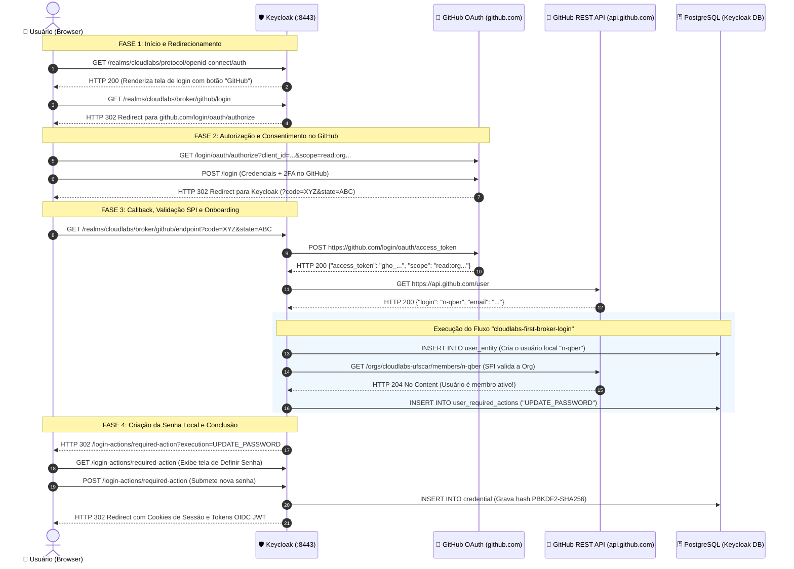

# 🔐 Fluxo Detalhado de Autenticação: Keycloak + GitHub + Validação SPI

Este documento apresenta o diagrama de sequência visual e o detalhamento técnico de todas as requisições HTTP e trocas de mensagens entre o **Navegador**, **Keycloak**, **GitHub OAuth / API**, **PostgreSQL** e o **SPI personalizado de validação de organização**.

---

## 📊 Diagrama de Sequência Completo

---

## 🔍 Detalhamento Passo a Passo

### 1. Início da Autenticação
* **Requisição 1:** `GET /realms/cloudlabs/protocol/openid-connect/auth`
  * O usuário acessa uma aplicação protegida (Incus Web, dashboard, console) ou a rota de autorização OIDC.
* **Requisição 2:** `GET /realms/cloudlabs/broker/github/login`
  * O usuário clica no botão de login com GitHub. O Keycloak inicializa a sessão temporária de broker e devolve um redirecionamento `HTTP 302` para o GitHub.

### 2. Autenticação no Provedor Externo (GitHub)
* **Requisição 3:** `GET https://github.com/login/oauth/authorize`
  * Parâmetros: `client_id`, `scope=openid user:email read:org`, `redirect_uri` e `state`.
* **Requisição 4:** O usuário preenche usuário, senha e token 2FA no GitHub.
* **Requisição 5:** `GET /realms/cloudlabs/broker/github/endpoint?code=XYZ&state=ABC`
  * O GitHub devolve o navegador para o Keycloak com o código temporário de autorização (`code`).

### 3. Validação no Backchannel e Execução do SPI
* **Requisição 6:** `POST https://github.com/login/oauth/access_token`
  * O Keycloak troca o código temporário pelo token OAuth de acesso (`gho_...`). Com a configuração `storeToken: true`, esse token fica retido no contexto do broker.
* **Requisição 7:** `GET https://api.github.com/user`
  * O Keycloak baixa o perfil básico (`login`, `name`, `email`).
* **Requisição 8:** Execução do fluxo `cloudlabs-first-broker-login`:
  1. Cria o registro local da conta no Postgres (`user_entity`) com `username = "n-qber"`.
  2. O plugin SPI (`GitHubOrgAuthenticator`) executa:
     `GET https://api.github.com/orgs/cloudlabs-ufscar/members/n-qber`
  3. O GitHub responde `HTTP 204 No Content` (confirmação oficial de associação à organização).
  4. O plugin adiciona a ação obrigatória `UPDATE_PASSWORD` na conta recém-criada.

### 4. Criação da Senha e Conclusão
* **Requisições 9 e 10:** O usuário é encaminhado para a tela de definição de senha local. Ao submeter a senha:
  - O Keycloak gera o hash seguro `PBKDF2-SHA256` (27.500 iterações).
  - Persiste a credencial no banco local.
* **Requisição 11:** O usuário é autenticado com sucesso e recebe a sessão SSO e os tokens JWT finais.

---

> [!TIP]
> A partir desse primeiro login, o usuário tem **soberania de acesso**: pode logar clicando no GitHub ou digitando sua senha diretamente, sem depender da API externa do GitHub no dia a dia.
