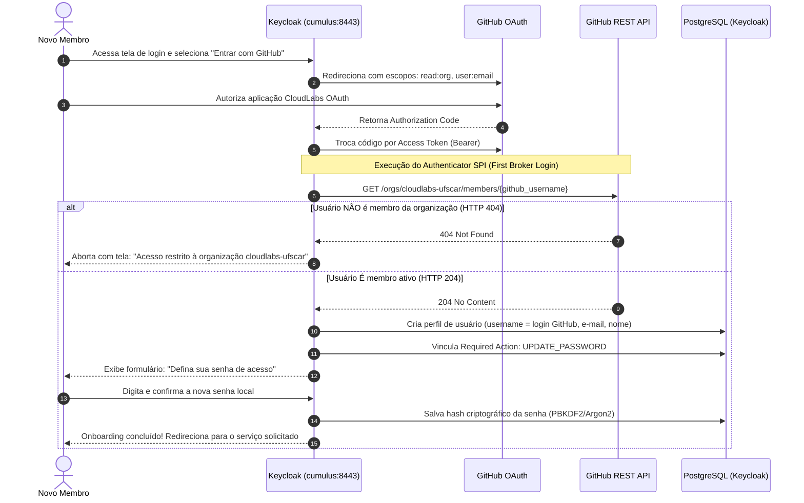
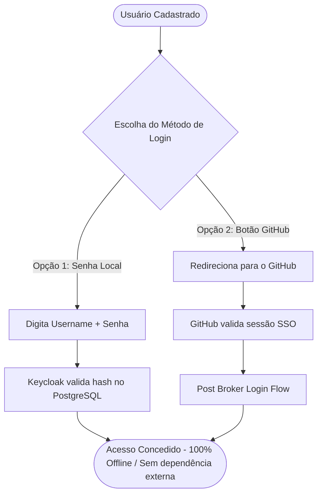

# Federação GitHub, Onboarding e Autenticação Híbrida

Este documento descreve a arquitetura de **Onboarding e Federação de Identidades via GitHub**, com validação estrita de participação na organização **`cloudlabs-ufscar`**, auto-provisionamento de perfis no PostgreSQL do Keycloak e obrigatoriedade de criação de senha local para garantir soberania e resiliência operacional.

---

## 1. Motivação e Decisões de Design (ADR)

### Contexto
O laboratório **CloudLabs UFSCar** necessita de um processo simples para que novos membros (pesquisadores, alunos e operadores) acessem as plataformas do laboratório (Incus, OpenStack Stratus, portais web).

### Princípios Arquiteturais Adotados
1. **Resiliência e Independência Local (On-Premises Sovereignty):**
   * A infraestrutura local (servidores bare-metal, clusters Incus e OpenStack) **não pode depender de serviços externos na nuvem (GitHub)** para autenticações rotineiras.
   * Se o link externo de internet do Datacenter oscilar ou o GitHub sofrer indisponibilidade, os operadores com senha local continuam acessando o ambiente normalmente.
2. **Gatekeeper no Primeiro Acesso (Onboarding Seguro):**
   * O GitHub é utilizado estritamente como **autoridade de validação de elegibilidade** no momento do primeiro acesso.
   * Apenas usuários que comprovadamente pertençam à organização GitHub `cloudlabs-ufscar` conseguem se cadastrar.
3. **Persistência Centralizada e Gestão Local de Identidades (KISS):**
   * Uma vez validado, o perfil do usuário passa a ser persistido no PostgreSQL local do Keycloak.
   * O usuário é forçado a definir uma senha local (`UPDATE_PASSWORD`).
   * A gestão de saída (offboarding) é administrativa: quando um membro deixa o laboratório, a equipe desativa a conta diretamente no Keycloak ou via automação de limpeza.

---

## 2. Visão Geral dos Fluxos

### Fluxo 1: Onboarding de Novo Usuário (Primeiro Login via GitHub)

O diagrama abaixo ilustra o ciclo de vida completo do primeiro acesso:



---

### Fluxo 2: Autenticação no Dia a Dia (Híbrida)

Após a conclusão do onboarding, o usuário tem **duas alternativas** para se autenticar:



* **Login por Senha:** Ultra rápido, sem qualquer requisição externa para a internet. Ideal para terminais CLI, automações e operabilidade em caso de corte no link de internet.
* **Login por GitHub:** Praticidade de SSO web com 1 clique.

---

### Fluxo 3: Desligamento do Laboratório (Offboarding)

Quando um integrante deixa a equipe do CloudLabs UFSCar:
1. **No GitHub:** O administrador remove o usuário da organização `cloudlabs-ufscar`.
2. **No Keycloak:** O administrador (ou script de rotina) localiza o usuário e define `enabled: false`.
3. **Resultado Imediato:**
   * Todas as sessões ativas são invalidadas no Keycloak.
   * O usuário não consegue mais logar por senha local.
   * Se tentar logar pelo GitHub, a validação no Keycloak rejeitará o acesso.
   * O OpenFGA deixará de emitir permissões, pois o usuário não recebe mais tokens JWT válidos.

---

## 3. Especificação do Plugin SPI: `keycloak-github-org-validator`

Para manter a modularidade e alinhamento com a arquitetura existente (como o [`keycloak-openfga-event-publisher`](https://github.com/cloudlabs-ufscar/keycloak-openfga-event-publisher)), o validador deve residir em um repositório próprio sob a organização:

* **Repositório:** [`cloudlabs-ufscar/keycloak-github-org-validator`](https://github.com/cloudlabs-ufscar/keycloak-github-org-validator)
* **Artefato de saída:** `keycloak-github-org-validator.jar`
* **Destino no container:** `/opt/keycloak/providers/keycloak-github-org-validator.jar`

### Interfaces Implementadas
A extensão implementa duas interfaces fundamentais do ecossistema Keycloak:
1. `org.keycloak.authentication.Authenticator`: Contém a lógica de execução durante o fluxo.
2. `org.keycloak.authentication.AuthenticatorFactory`: Registra o plugin no motor Quarkus do Keycloak e expõe suas configurações no painel administrativo.

### Lógica Central de Execução (`authenticate`)
```java
@Override
public void authenticate(AuthenticationFlowContext context) {
    BrokeredIdentityContext brokerContext = (BrokeredIdentityContext) context.getAuthenticationSession()
            .getAuthNote(KeycloakModelUtils.BROKERED_IDENTITY_CONTEXT);

    if (brokerContext == null) {
        context.success();
        return;
    }

    String providerId = brokerContext.getIdpConfig().getProviderId();
    if (!"github".equalsIgnoreCase(providerId)) {
        // Se não for GitHub, não intercepta
        context.success();
        return;
    }

    String githubUsername = brokerContext.getUsername();
    String accessToken = brokerContext.getToken(); // Token temporário OAuth

    String targetOrg = "cloudlabs-ufscar";
    boolean isMember = checkGitHubOrgMembership(targetOrg, githubUsername, accessToken);

    if (!isMember) {
        Response errorResponse = context.form()
                .setError("Acesso não autorizado: sua conta GitHub @" + githubUsername 
                        + " não pertence à organização " + targetOrg + ".")
                .createErrorPage(Response.Status.FORBIDDEN);
        context.failure(AuthenticationFlowError.ACCESS_DENIED, errorResponse);
        return;
    }

    // Usuário aprovado: garante que terá que cadastrar uma senha local
    context.getAuthenticationSession().addRequiredAction(UserModel.RequiredAction.UPDATE_PASSWORD);
    context.success();
}
```

---

## 4. Integração no `Auth-repo`

### Estrutura de Arquivos no Ansible
```text
scripts/ansible-iam/roles/deploy/
├── files/
│   ├── keycloak-openfga-event-publisher.jar  # Plugin OpenFGA
│   ├── keycloak-github-org-validator.jar    # Novo Plugin Validador GitHub
│   ├── schema-keycloak.json                 # Definição do Realm
│   └── haproxy.cfg
```

### Configuração no `schema-keycloak.json`
No Identity Provider `github`:
```json
{
  "alias": "github",
  "providerId": "github",
  "enabled": true,
  "firstBrokerLoginFlowAlias": "cloudlabs-first-broker-login",
  "config": {
    "clientId": "${env.GITHUB_CLIENT_ID:}",
    "clientSecret": "${env.GITHUB_CLIENT_SECRET:}",
    "defaultScope": "openid user:email read:org",
    "syncMode": "IMPORT"
  }
}
```

---

## 5. Matriz de Resiliência

| Cenário de Falha | Impacto no Onboarding (GitHub) | Impacto no Login Diário (Senha) |
| :--- | :--- | :--- |
| **Queda do link de internet da UFSCar** | Novos membros não conseguem se cadastrar temporariamente. | **Nenhum.** Usuários existentes continuam operando normalmente via PostgreSQL local. |
| **Instabilidade / Queda da API do GitHub** | Novos cadastros são bloqueados com segurança. | **Nenhum.** Autenticação com credencial local é 100% independente do GitHub. |
| **Membro expulso da organização GitHub** | Não consegue reabrir sessão social pelo GitHub. | Bloqueado assim que o admin definir `enabled: false` no Keycloak. |
