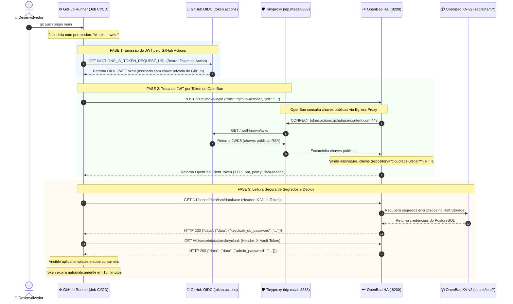

# 🔐 Federação Zero-Trust: GitHub Actions OIDC + OpenBao HA

Este documento descreve a arquitetura e o fluxo de autenticação **Zero-Trust** utilizando **OpenID Connect (OIDC)** entre o **GitHub Actions** e o cluster **OpenBao**, eliminando a necessidade de credenciais estáticas (tokens de longa duração ou senhas salvas em disco) para a leitura de segredos na pipeline de CI/CD.

---

## 1. Contexto e Motivação (Zero-Trust Architecture)

### O Problema dos Tokens Estáticos
Tradicionalmente, pipelines de CI/CD utilizam segredos estáticos (como tokens de serviço do Vault gravados nos *GitHub Secrets* ou arquivos `.token` no nó bastion). Essa abordagem apresenta vulnerabilidades:
* Risco de vazamento em logs ou comprometimento de nós intermediários.
* Dificuldade de rotação periódica e revogação granular.
* Falta de rastreabilidade fina (auditoria não identifica qual execução exata realizou a operação).

### A Solução via OIDC
Com a Federação OIDC:
1. O GitHub Actions emite um **token JWT criptograficamente assinado** para o job em execução.
2. O OpenBao valida a assinatura do JWT contra as chaves públicas oficiais do GitHub (`jwks`).
3. O OpenBao inspeciona as claims do JWT (`repository`, `actor`, `ref`) e emite um **token de curtíssima duração (TTL: 15 minutos)** vinculado à política de menor privilégio (`iam-reader`).
4. Ao final da execução, o token expira automaticamente sem deixar rastros ou credenciais reutilizáveis.

---

## 2. Diagrama de Sequência Completo



---

## 3. Detalhamento Técnico Passo a Passo

### Passo 1: Permissão e Solicitação do JWT no GitHub Actions
No workflow `.github/workflows/deploy.yml`, o job declara a permissão explícita para solicitar tokens de identidade:
```yaml
permissions:
  contents: read
  id-token: write    # <-- Permite gerar o token OIDC
```
O runner utiliza as variáveis internas injetadas pelo GitHub para obter o token:
```bash
JWT_TOKEN=$(curl -sLS "${ACTIONS_ID_TOKEN_REQUEST_URL}&audience=https://vault.maas:8200" \
  -H "User-Agent: actions/oidc-client" \
  -H "Authorization: Bearer ${ACTIONS_ID_TOKEN_REQUEST_TOKEN}" | jq -r '.value')
```

#### Anatomia das Claims do JWT do GitHub:
```json
{
  "iss": "https://token.actions.githubusercontent.com",
  "aud": "https://vault.maas:8200",
  "repository": "cloudlabs-ufscar/Auth-repo",
  "actor": "n-qber",
  "ref": "refs/heads/main",
  "sha": "5f201a8...",
  "job_workflow_ref": "cloudlabs-ufscar/Auth-repo/.github/workflows/deploy.yml@refs/heads/main"
}
```

---

### Passo 2: Troca do JWT por Token de Acesso no OpenBao
O runner faz uma requisição `POST` para o endpoint de autenticação JWT do OpenBao:
```http
POST /v1/auth/jwt/login HTTP/1.1
Host: vault.maas:8200
Content-Type: application/json

{
  "role": "github-actions",
  "jwt": "eyJhbGciOiJSUzI1NiIs..."
}
```

---

### Passo 3: Validação das Chaves via Egress Proxy (Tinyproxy)
Como o cluster OpenBao reside na rede interna `.maas` sem gateway de internet direto, o serviço utiliza a configuração de proxy configurada em `/etc/systemd/system/openbao.service.d/proxy.conf`:
* `HTTPS_PROXY=http://idp.maas:8888`
* O `tinyproxy` filtra o tráfego estritamente para `token.actions.githubusercontent.com`.
* O OpenBao baixa o JWKS (`https://token.actions.githubusercontent.com/.well-known/jwks`) e valida:
  1. **Assinatura criptográfica:** Garante que o token foi emitido pelo GitHub.
  2. **Validade temporal (`exp`):** Garante que o token não expirou.
  3. **Regra de vinculação (`bound_claims`):** Valida se `repository` pertence a `cloudlabs-ufscar/*`.

---

### Passo 4: Emissão do Token de Sessão Scoped
O OpenBao devolve um token temporário com a política restrita `iam-reader`:
```json
{
  "auth": {
    "client_token": "s.a1b2c3d4e5f6g7h8",
    "accessor": "accessor-xyz",
    "policies": ["default", "iam-reader"],
    "token_policies": ["default", "iam-reader"],
    "lease_duration": 900,
    "renewable": false
  }
}
```

---

### Passo 5: Leitura dos Segredos via REST API
Com o token em mãos (`s.a1b2c3d4e5f6g7h8`), a automação (ou playbook Ansible) executa chamadas simples e seguras:
```bash
# Leitura das senhas do banco de dados:
curl -s -H "X-Vault-Token: $CLIENT_TOKEN" \
  http://vault3.maas:8200/v1/secret/data/iam/database | jq .data.data

# Leitura da senha do admin do Keycloak:
curl -s -H "X-Vault-Token: $CLIENT_TOKEN" \
  http://vault3.maas:8200/v1/secret/data/iam/keycloak | jq .data.data
```

---

## 4. Configuração Aplicada no OpenBao (`configure-openbao-proxy-oidc.yml`)

A configuração do motor OIDC no OpenBao é realizada de forma idempotente via Ansible:

```yaml
# 1. Habilitação do método de autenticação JWT
bao auth enable jwt

# 2. Configuração do OIDC Discovery
bao write auth/jwt/config \
  oidc_discovery_url="https://token.actions.githubusercontent.com"

# 3. Criação da Role do GitHub Actions com menor privilégio
bao write auth/jwt/role/github-actions \
  role_type="jwt" \
  user_claim="actor" \
  bound_issuer="https://token.actions.githubusercontent.com" \
  bound_claims_type="glob" \
  bound_claims='{"repository": "cloudlabs-ufscar/*"}' \
  policies="iam-reader" \
  ttl="15m"
```

---

## 5. Matriz de Segurança e Privilégios

| Componente | Nível de Acesso | Política | Validade |
| :--- | :--- | :--- | :--- |
| **GitHub Actions JWT** | Emissor de identidade | OIDC Claims (`repository`, `actor`) | ~10 minutos |
| **OpenBao Client Token** | Leitura exclusiva de `secret/data/iam/*` | `iam-reader` | 15 minutos |
| **Egress Proxy (Tinyproxy)** | Somente saída HTTP/HTTPS para JWKS | Whitelist de domínio | Permanente |
| **Tokens Estáticos em Disco** | **Eliminados completamente** | N/A | N/A |
