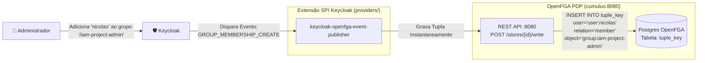

```mermaid
sequenceDiagram
    autonumber
    actor Dev as 👤 Operador (Terminal CLI)
    participant CLI as 💻 Incus CLI
    participant INCUS as 🌐 Incus Server (:8443)
    participant KC as 🛡️ Keycloak (:8443)
    actor Browser as 🌍 Navegador Web do Operador

    Dev->>CLI: incus remote add cirrus https://... --auth-type=oidc
    CLI->>INCUS: GET /1.0 (Solicita metadados OIDC do servidor)
    INCUS-->>CLI: Retorna oidc.issuer (Keycloak) e client_id ("incus-cirrus")
    
    rect rgb(30, 40, 55)
        Note over CLI,KC: FASE 1: Solicitação de Código de Dispositivo (Device Code)
        CLI->>KC: POST /protocol/openid-connect/auth/device (client_id=incus-cirrus)
        KC-->>CLI: Retorna device_code, user_code ("WDJB-HGZX"), verification_uri, interval=5s
        CLI-->>Dev: Exibe no terminal:<br/>"Acesse https://cumulus.dc.ufscar.br:8443/realms/cloudlabs/device<br/>e digite o código: WDJB-HGZX"
    end

    rect rgb(20, 50, 40)
        Note over Dev,KC: FASE 2: Consentimento e Autenticação no Navegador
        Dev->>Browser: Abre a URL informada
        Browser->>KC: GET /realms/cloudlabs/device
        Browser->>KC: Submete código: "WDJB-HGZX"
        KC-->>Browser: Exibe tela de autenticação
        Browser->>KC: Login (GitHub OAuth SSO ou Senha Local)
        KC-->>Browser: "Dispositivo autorizado com sucesso!"
    end

    rect rgb(35, 45, 60)
        Note over CLI,KC: FASE 3: Polling Assíncrono e Resgate do JWT
        loop A cada 5 segundos
            CLI->>KC: POST /protocol/openid-connect/token (grant_type=device_code)
            alt Usuário ainda não autorizou
                KC-->>CLI: HTTP 400 {"error": "authorization_pending"}
            else Autorização concluída no navegador
                KC-->>CLI: HTTP 200 {"access_token": "JWT...", "refresh_token": "..."}
            end
        end
        CLI->>CLI: Grava tokens em ~/.config/incus/oidc/cirrus.json
        CLI-->>Dev: "Remote cirrus added successfully!"
    end
```

# 🔐 Autenticação e Autorização no Incus: CLI, Web UI e OpenFGA (ReBAC)

Este documento detalha o funcionamento dos mecanismos de **Autenticação (AuthN)** e **Autorização (AuthZ)** no cluster de containers e máquinas virtuais **Incus (Cirrus / Stratus)** integrado ao **Keycloak** e ao **OpenFGA**.

---

## 1. Por que a CLI e a Web UI possuem fluxos de Autenticação diferentes?

O client OIDC [`incus-cirrus`](../../scripts/ansible-iam/roles/deploy/files/schema-keycloak.json) está configurado no Keycloak para suportar **dois fluxos OIDC distintos**, pois a CLI e a interface Web operam sob restrições técnicas fundamentalmente diferentes:

| Característica | Incus CLI (Terminal) | Incus Web UI (Navegador) |
| :--- | :--- | :--- |
| **Fluxo OAuth 2.0 / OIDC** | **Device Authorization Grant** ([RFC 8628](https://datatracker.ietf.org/doc/html/rfc8628)) | **Authorization Code Flow com PKCE** ([RFC 7636](https://datatracker.ietf.org/doc/html/rfc7636)) |
| **Contexto de Execução** | Headless / Terminal / Sessões SSH remotas | Navegador web completo (Chrome, Firefox, Safari) |
| **Capacidade de Redirecionamento HTTP** | **Não possui**. O terminal não consegue interceptar redirects `HTTP 302` sem abrir portas locais (inviável em SSH ou hosts multi-usuário). | **Nativa**. O navegador processa redirecionamentos `HTTP 302` perfeitamente entre o Incus e o Keycloak. |
| **Como o usuário autentica?** | O terminal exibe um código curto (ex: `WDJB-HGZX`) e uma URL. O usuário digita o código em qualquer navegador. | Redirecionamento instantâneo para a página de login do Keycloak com retorno automático via callback. |
| **Armazenamento de Tokens** | No disco local do operador em `~/.config/incus/oidc/` (permissão restrita `0600`). | No armazenamento de sessão do navegador (`SessionStorage` / Cookies seguros). |
| **Configuração no Keycloak** | `"attributes": { "oauth2.device.authorization.grant.enabled": "true" }` | `"standardFlowEnabled": true` com `redirectUris: ["https://cirrus.dc.ufscar.br:8443/*"]` |

---

## 2. Diagrama 1: Autenticação via Incus CLI (Device Authorization Grant RFC 8628)

Quando um operador conecta o terminal ao cluster executando:
```bash
incus remote add cirrus https://cumulus.dc.ufscar.br:8443 --auth-type=oidc
```



---

## 3. Diagrama 2: Autenticação via Incus Web UI (Auth Code Flow com PKCE RFC 7636)

Quando o usuário acessa o dashboard gráfico do cluster em `https://cirrus.dc.ufscar.br:8443/ui/`:

```mermaid
sequenceDiagram
    autonumber
    actor Dev as 👤 Usuário (Navegador)
    participant UI as 🖥️ Incus Web UI (Frontend)
    participant KC as 🛡️ Keycloak (IdP)
    participant INCUS as ⚙️ Incus API Backend

    Dev->>UI: Acessa https://cirrus.dc.ufscar.br:8443/ui/
    UI->>UI: Gera code_verifier criptográfico e calcula code_challenge (SHA-256)
    UI-->>Dev: HTTP 302 Redirect para Keycloak
    
    rect rgb(30, 40, 55)
        Note over Dev,KC: Redirecionamento OIDC com PKCE
        Dev->>KC: GET /protocol/openid-connect/auth?<br/>client_id=incus-cirrus&response_type=code<br/>&code_challenge=XYZ&code_challenge_method=S256<br/>&redirect_uri=https://cirrus.dc.ufscar.br:8443/ui/oidc/callback
        KC-->>Dev: Renderiza tela de login
        Dev->>KC: Autentica (GitHub ou Senha)
        KC-->>Dev: HTTP 302 Redirect para Incus Callback (?code=AUTH_CODE_123)
    end

    rect rgb(20, 50, 40)
        Note over UI,KC: Troca de Código por Tokens (Sem expor credenciais)
        Dev->>UI: GET /ui/oidc/callback?code=AUTH_CODE_123
        UI->>KC: POST /protocol/openid-connect/token<br/>(code=AUTH_CODE_123, code_verifier=SEGREDO_PKCE)
        KC->>KC: Valida se SHA256(code_verifier) == code_challenge original
        KC-->>UI: HTTP 200 {"access_token": "JWT...", "id_token": "..."}
        UI->>UI: Salva sessão no SessionStorage
        UI->>INCUS: GET /1.0 com Header "Authorization: Bearer JWT"
        INCUS-->>UI: Retorna dados do cluster e recursos permitidos
        UI-->>Dev: Exibe painel de controle do Incus
    end
```



---

## 4. O Fluxo de Autorização Atual: Incus + OpenFGA (ReBAC / Zanzibar)

Após autenticar (seja via CLI ou Web UI), **toda e qualquer ação no Incus passa pelo OpenFGA** para verificar se o usuário tem permissão para executar a operação no projeto solicitado.

### Papéis na Arquitetura:
* **PEP (Policy Enforcement Point):** O daemon do **Incus**. Ele intercepta a requisição, extrai o usuário do JWT e pergunta ao OpenFGA se a ação é permitida.
* **PDP (Policy Decision Point):** O serviço **OpenFGA**. Ele avalia o modelo de dados baseado em relacionamentos (ReBAC) e responde `{"allowed": true}` ou `{"allowed": false}`.
* **Sincronizador de Identidades:** O plugin SPI **`keycloak-openfga-event-publisher`**, que mantém os grupos do Keycloak espelhados no grafo do OpenFGA em tempo real.

---

### Diagrama 3: Validação de Permissão Passo a Passo (OpenFGA Check)

Cenário: O usuário `nicolas` executa o comando `incus launch images:ubuntu/24.04 vm1 --project iam-project`.

```mermaid
sequenceDiagram
    autonumber
    actor Dev as 👤 Usuário (nicolas)
    participant CLI as 💻 Incus CLI / Web UI
    participant INCUS as 🛡️ Incus Daemon (PEP)
    participant FGA as ⚖️ OpenFGA v1.5.5 (PDP)
    participant DB as 🗄️ PostgreSQL (OpenFGA Tuples)

    Dev->>CLI: incus launch images:ubuntu/24.04 vm1 --project iam-project
    CLI->>INCUS: POST /1.0/instances?project=iam-project<br/>(Header: Authorization: Bearer JWT)
    
    rect rgb(30, 40, 55)
        Note over INCUS: 1. Validação Criptográfica do Token (PEP)
        INCUS->>INCUS: Valida assinatura do JWT com a chave pública do Keycloak
        INCUS->>INCUS: Extrai claim oidc.claim: "preferred_username" = "nicolas"
        INCUS->>INCUS: Identifica ação requerida: relation="operator", object="project:iam-project"
    end

    rect rgb(20, 50, 40)
        Note over INCUS,FGA: 2. Consulta de Decisão de Acesso (Check Request)
        INCUS->>FGA: POST /stores/01KY7TAWJYJ5KR48TK19E1CT99/check<br/>Header: Authorization: Bearer <OPENFGA_API_TOKEN><br/>{<br/>  "tuple_key": {<br/>    "user": "user:nicolas",<br/>    "relation": "operator",<br/>    "object": "project:iam-project"<br/>  }<br/>}
    end

    rect rgb(35, 45, 60)
        Note over FGA,DB: 3. Resolução do Grafo Zanzibar no PostgreSQL
        FGA->>DB: Busca relações diretas e heranças de grupos
        Note over DB: Grafo de relações avaliado:<br/>1. user:nicolas é membro de group:iam-project-admin<br/>2. group:iam-project-admin#member tem relation "admin" em project:iam-project<br/>3. No modelo ReBAC: relation "admin" herda "operator" e "viewer"
        DB-->>FGA: Grafo resolvido: Associação VÁLIDA
        FGA-->>INCUS: HTTP 200 {"allowed": true}
    end

    rect rgb(20, 50, 40)
        Note over INCUS: 4. Execução da Operação
        INCUS->>INCUS: Inicia criação do container/VM no cluster
        INCUS-->>CLI: HTTP 200 Operation Success {"status": "Running"}
        CLI-->>Dev: "Instance vm1 successfully created!"
    end
```



---

### E se o usuário NÃO tiver permissão?

Se um usuário pertencente apenas ao grupo `monitoring-project-user` tentar criar uma instância no `iam-project`:

1. O Incus consulta o OpenFGA: `user:dudu`, `relation: operator`, `object: project:iam-project`.
2. O OpenFGA varre o grafo no banco e detecta que não há caminho de conexão entre `user:dudu` e `project:iam-project`.
3. O OpenFGA responde:
   ```json
   {
     "allowed": false,
     "resolution": ""
   }
   ```
4. O daemon do Incus aborta imediatamente a requisição sem tocar em nenhum recurso e devolve ao terminal:
   ```text
   Error: 403 Forbidden: You do not have permission to create instances in project 'iam-project'
   ```

---

## 5. Como os Grupos do Keycloak são Sincronizados com o OpenFGA

Para que o OpenFGA saiba a quais grupos o usuário pertence sem que ninguém precise duplicar cadastros manualmente, atua o plugin **`keycloak-openfga-event-publisher`**:



1. Quando o usuário conclui o primeiro login ou o admin atribui um grupo no Keycloak, o evento `GROUP_MEMBERSHIP_CREATE` é gerado.
2. O plugin SPI intercepta o evento e grava imediatamente a tupla no OpenFGA via REST API interna:
   ```json
   {
     "writes": {
       "tuple_keys": [
         {
           "user": "user:nicolas",
           "relation": "member",
           "object": "group:iam-project-admin"
         }
       ]
     }
   }
   ```
3. Se o usuário for removido do grupo, o evento `GROUP_MEMBERSHIP_DELETE` apaga a tupla correspondente, revogando o acesso em milissegundos em todos os servidores do Incus.

---

## 6. Matriz de Relacionamentos do Modelo OpenFGA

Conforme definido em [`schema-openfga-1.json`](../../scripts/ansible-iam/roles/deploy/files/schema-openfga-1.json):

| Objeto no OpenFGA | Relação ReBAC | Papel / Grupo Keycloak | O que permite no Incus? |
| :--- | :--- | :--- | :--- |
| `server:incus` | `admin` | `group:admin-project-admin#member` | **Super Administrador:** Acesso irrestrito a todo o cluster, storage pools, redes globais e qualquer projeto. |
| `project:<nome>` | `admin` | `group:<nome>-admin#member` | **Admin do Projeto:** Criar, editar e deletar instâncias, volumes, perfis e quotas dentro do projeto. |
| `project:<nome>` | `operator` | `group:<nome>-operator#member` | **Operador:** Iniciar, parar, reiniciar, tirar snapshots e abrir console (`incus exec`) nas instâncias. |
| `project:<nome>` | `user` / `viewer` | `group:<nome>-user#member` | **Visualizador:** Listar instâncias (`incus list`), ver status e métricas, sem poder modificar recursos. |
