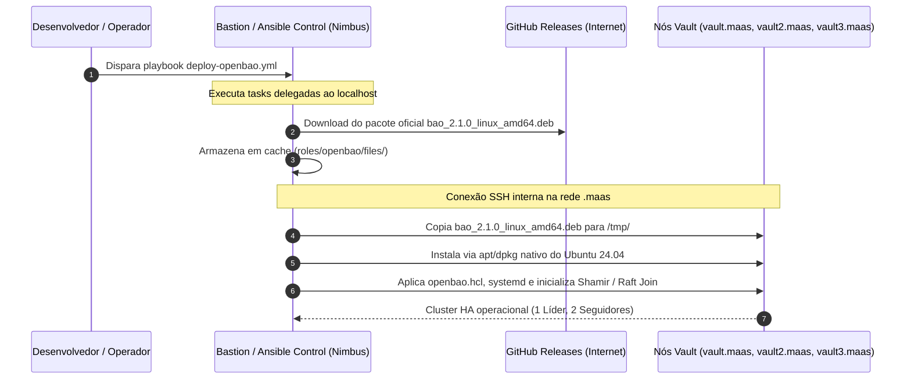
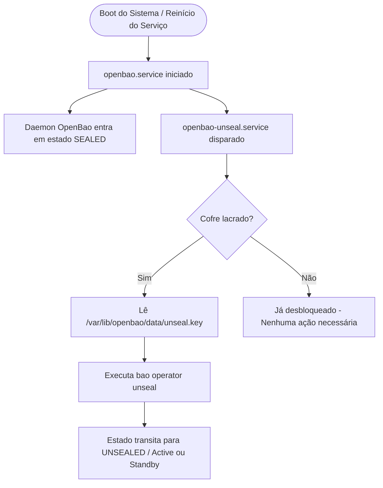

# Gestão Centralizada de Segredos & PKI com OpenBao

Este documento descreve a arquitetura, o modelo de implantação em Alta Disponibilidade (HA), a Autoridade de Certificação Interna (PKI Root CA), a integração dinâmica de segredos com o cluster Incus e a evolução para autenticação **Zero-Trust com OIDC** no ambiente de Identidade e Acesso (IAM) do **CloudLabs - UFSCar**.

---

## 1. 🛡️ Visão Geral & Contexto Arquitetural

O **OpenBao** é uma bifurcação (*fork*) comunitária de código aberto do HashiCorp Vault sob a égide da **Linux Foundation**, projetada para manter a governança 100% aberta e compatibilidade estrita com as APIs e ferramentas do ecossistema Vault.

Na infraestrutura do laboratório, o OpenBao atua como o **Secret Management Provider** e a **Root of Trust (Raiz de Confiança)**, desempenhando quatro funções estratégicas:
1. **Armazenamento Seguro de Segredos (KV-v2):** Tokens de autenticação de API, credenciais de banco e chaves sensíveis de serviços como OpenFGA e Keycloak.
2. **Autoridade de Certificação Interna (PKI Secrets Engine):** Emissão da Root CA do laboratório (`CloudLabs Internal Root CA`) para gerenciar a cadeia de confiança e comunicação TLS/mTLS entre serviços internos sem dependência de autoridades externas.
3. **Princípio do Menor Privilégio (*Least Privilege*):** Políticas ACL restritivas (`iam-reader`) e tokens de curta duração/escopo delimitado.
4. **Provisionamento Dinâmico de Infraestrutura:** Integração com automações Ansible para injetar segredos dinamicamente nos nós gerenciados, eliminando credenciais em texto plano nos repositórios Git.

---

## 2. 🌐 Arquitetura de Rede e Resolução DNS (.maas)

O cluster do OpenBao foi provisionado na rede interna do MAAS com resolução de nomes totalmente gerenciada:

- **Rede Privada:** VLAN `192.168.69.0/24` (domínio `.maas`).
- **Resolução de Nomes:** Todos os nós da infraestrutura comunicam-se exclusivamente via nomes DNS `.maas` gerenciados pelo servidor DNS do MAAS (`vault.maas`, `vault2.maas`, `vault3.maas`, `idp.maas`, `inc1.maas`), eliminando o acoplamento a endereços IP estáticos.
- **Segurança da Rede:** A rede `.69` não possui rota de saída para a internet (`gateway_ip: null` no MAAS e sem NAT WAN no Nimbus). Isso impede exposição do cofre à rede externa ou ataques direcionados de fora.

### Padrão de Implantação Air-Gapped (via Nimbus Bastion)
Para instalar o OpenBao sem violar o isolamento dos nós e sem necessitar de túneis de internet ou proxys nas máquinas do cofre:



---

## 3. 💾 Cluster de Alta Disponibilidade (HA) com Raft Storage

O OpenBao utiliza o **Raft Storage Backend** integrado. Esse mecanismo elimina qualquer dependência de bancos externos (PostgreSQL, MySQL) ou clusters adicionais (Consul), garantindo replicação síncrona e consenso distribuído de alta velocidade.

### 3.1 Topologia de 3 Nós

| Hostname | Endereço MAAS | Papel Raft | Sistema Operacional | Storage Path | Porta API |
| :--- | :--- | :--- | :--- | :--- | :--- |
| **`vault.maas`** | `vault.maas` | **Leader (Voter)** | Ubuntu 24.04.5 LTS | `/var/lib/openbao/data` | `:8200` |
| **`vault2.maas`** | `vault2.maas` | **Follower (Voter)** | Ubuntu 24.04.5 LTS | `/var/lib/openbao/data` | `:8200` |
| **`vault3.maas`** | `vault3.maas` | **Follower (Voter)** | Ubuntu 24.04.5 LTS | `/var/lib/openbao/data` | `:8200` |

### 3.2 Formação e Consenso do Cluster
1. O primeiro nó (`vault.maas`) é inicializado como líder inicial.
2. Os nós seguidores (`vault2.maas` e `vault3.maas`) executam o comando `bao operator raft join http://vault.maas:8200`, ingressando no conjunto de votação Raft via nome de rede.
3. Se o líder sofrer falha, os nós seguidores elegem automaticamente um novo líder em frações de segundo, sem interrupção de serviço.

---

## 4. 🔑 Inicialização Shamir & Mecanismo de Auto-Unseal

Por padrão de segurança, instâncias do Vault/OpenBao iniciam em estado **Sealed** (lacrado). Enquanto selado, os dados criptografados em disco não podem ser lidos nem descriptografados.

### Modelo de Inicialização:
- **Algoritmo:** Shamir's Secret Sharing (1 share, threshold 1).
- **Armazenamento Seguro:** As chaves de unseal residem com permissão estrita `0400` em `/var/lib/openbao/data/unseal.key` e `/var/lib/openbao/data/root.token`.
- **Propagação Automática:** O playbook do Ansible sincroniza com segurança as chaves de unseal entre todos os membros do cluster Raft.

### Serviço de Auto-Unseal via Systemd:
Em cada um dos nós (`vault.maas`, `vault2.maas`, `vault3.maas`), há um serviço systemd dedicado para manter o cofre operacional após reboots:



---

## 5. 📜 Root of Trust: PKI Engine & CA Interna

Para unificar a segurança criptográfica interna e permitir comunicação HTTPS/mTLS confiável entre serviços locais sem depender de CAs públicas externas:

1. **Habilitação da Engine:**
   - Montada no caminho `pki/` com lease máximo de 15 anos (`131400h`).
2. **Geração da Root CA:**
   - **Nome:** `CloudLabs Internal Root CA`
   - **Chave Privada:** Gerada e armazenada de forma segura dentro do cofre (nunca exportada ou exposta fora do OpenBao).
   - **Validade:** 29 de Setembro de 2026 até 25 de Setembro de 2041.
   - **Certificado Público:** Exportado para `files/cloudlabs-ca.crt`.
3. **Distribuição Automatizada:**
   - O Ansible instala o certificado público em `/usr/local/share/ca-certificates/cloudlabs-ca.crt` em todos os nós da infraestrutura (`idp.maas`, `inc1-cirrus`, `inc2-cirrus`, `inc3-cirrus`).
   - A trust store do sistema operacional é atualizada via `update-ca-certificates`.

---

## 6. 🔐 Gestão de Segredos do OpenFGA & Menor Privilégio

As credenciais necessárias para o cluster Incus interagir com o OpenFGA foram centralizadas no OpenBao:

### Segredos Armazenados (`secret/data/iam/openfga`):
- `api_token`: Token de autenticação da API do OpenFGA.
- `store_id`: ID do Store configurado no OpenFGA (`01KY7TAWJYJ5KR48TK19E1CT99`).

### Política de Acesso Restrito (`iam-reader`):
```hcl
path "secret/data/iam/*" {
  capabilities = ["read"]
}
```
Um token de serviço derivado desta política foi gerado para automação. Tentativas de escrita ou leitura fora do escopo `iam/*` são barradas com `403 Permission Denied`.

---

## 7. ⚙️ Integração Dinâmica com o Cluster Incus (`configure-incus.yml`)

O playbook de configuração do Incus (`configure-incus/configure-incus.yml`) consulta o OpenBao dinamicamente via `http://vault.maas:8200` em tempo de execução:

1. **Pre-tasks:** Lê o token de serviço, consulta `GET http://vault.maas:8200/v1/secret/data/iam/openfga` e distribui a Root CA.
2. **Configuração:** Aplica `authorization.openfga.api.token` e `authorization.openfga.store.id` dinamicamente no Incus.
3. **Idempotência & Rotação:** Testado em produção com sucesso (idempotência confirmada com `changed=0`, e rotação dinâmica validada com reload automático do daemon do Incus).

---

## 8. 🛡️ Evolução Arquitetural: Federação Zero-Trust via OIDC & Egress Proxy no IAM

Para eliminar completamente arquivos de token estáticos no disco (`openbao-token`), a arquitetura adota a **Federação OIDC com GitHub Actions** combinada com **Proxy de Saída Restrito no IAM**.

### 8.1 Por que o OpenBao precisa de um Egress Proxy?
O cluster OpenBao reside na rede interna `.maas` sem saída de internet. Para validar os tokens JWT gerados pelo GitHub Actions, o OpenBao precisa baixar as chaves públicas oficiais em `https://token.actions.githubusercontent.com/.well-known/jwks`.
Para não expor o cofre à internet, utilizamos um proxy de saída ultraleve (**`tinyproxy`**) instalado no servidor **`idp.maas`** (`http://idp.maas:8888`), com whitelist estrita de domínio:

```text
# Whitelist estrita no idp.maas (/etc/tinyproxy/filter):
token\.actions\.githubusercontent\.com
```
Qualquer outra requisição externa para a web é sumariamente bloqueada com `403 Forbidden`.

---

### 8.2 Topologias de Deploy: Bastion Nimbus vs. Deploy Direto no `idp.maas`

Na arquitetura do laboratório, existem duas formas de orquestrar a execução do deploy via GitHub Actions. Ambas são suportadas e comparadas abaixo:

```mermaid
flowchart TD
    subgraph Opcao_A["Opção A: Via Bastion Nimbus (Atual)"]
        GHA1[GitHub Actions] -->|1. SSH na porta 2002| NIMBUS[Nimbus Bastion]
        NIMBUS -->|2. JWT OIDC| BAO1[vault.maas :8200]
        BAO1 -->|3. Valida JWKS via Proxy| PROXY1[idp.maas Tinyproxy :8888]
        PROXY1 -->|4. Internet| GH1[GitHub JWKS]
        NIMBUS -->|5. Executa Playbooks| TARGETS1[idp.maas / inc1-3.maas]
    end

    subgraph Opcao_B["Opção B: Deploy Direto no idp.maas (Evolução sem Bastion)"]
        GHA2[GitHub Actions] -->|1. SSH direto na porta 22| IDP2["idp.maas (cumulus)<br/>Servidor de IAM"]
        IDP2 -->|2. JWT OIDC via rede interna .maas| BAO2[vault.maas :8200]
        BAO2 -->|3. Valida JWKS via Proxy local| PROXY2[idp.maas Tinyproxy :8888]
        PROXY2 -->|4. Internet| GH2[GitHub JWKS]
        IDP2 -->|5. Executa deploy local e Incus| TARGETS2[Stack Local + Incus Cluster]
    end
```



#### Comparativo Detalhado entre as Abordagens:

| Dimensão | Opção A: Via Bastion Nimbus (Implementação Atual) | Opção B: Deploy Direto no `idp.maas` (Evolução Arquitetural) |
| :--- | :--- | :--- |
| **Ponto de Entrada SSH** | Porta `2002` no Nimbus (`nimbus.dc.ufscar.br`). | Porta `22` direta no `idp.maas` (`cumulus.dc.ufscar.br`). |
| **Papel do Nimbus** | Bastion centralizador de todas as automações do datacenter. | Fica livre do deploy de IAM; atua apenas em manutenções gerais. |
| **Isolamento de Falhas (*Blast Radius*)** | Se o Nimbus sofrer indisponibilidade, o deploy do IAM é impactado. | **Totalmente isolado:** falhas no Nimbus não afetam a entrega contínua do IAM. |
| **Acesso ao Servidor do Vault** | O Nimbus historicamente possui SSH aos nós. | **Zero SSH no Vault:** a máquina `idp.maas` comunica-se **exclusivamente via API HTTP :8200 (`vault.maas:8200`)**, reforçando a separação estrita de privilégios. |
| **Simplicidade do Fluxo** | Requer saltar pelo bastion intermediário. | **Direto:** Menos saltos de rede e menor latência na pipeline. |

---

## 9. 🧪 Guia Rápido de Operação

### Checar Status do Cluster Raft e Nós
```bash
# No nó vault.maas:
export BAO_ADDR="http://127.0.0.1:8200"
export BAO_TOKEN=$(sudo cat /var/lib/openbao/data/root.token)

# Status da instância local
bao status

# Listar membros do cluster Raft
bao operator raft list-peers
```

### Ler e Atualizar Segredos do IAM
```bash
# Ler segredo com token de menor privilégio via nome DNS
curl -s -H "X-Vault-Token: $(cat /home/nicolas/ansible-scripts/files/openbao-token)" \
  http://vault.maas:8200/v1/secret/data/iam/openfga | jq .data.data

# Atualizar segredo (requer token com permissão de escrita)
bao kv put secret/iam/openfga api_token="novo-token" store_id="01KY7TAWJYJ5KR48TK19E1CT99"
```

### Executar Playbook de Sincronização do Incus
```bash
cd /home/nicolas/ansible-scripts
SSH_AUTH_SOCK=/tmp/ssh-agent-nicolas2.sock ansible-playbook -i hosts.yml configure-incus/configure-incus.yml
```

### Autenticar via JWT / GitHub Actions OIDC (Zero-Trust)
```bash
# Autenticação efêmera sem tokens estáticos:
bao write auth/jwt/login role="github-actions" jwt="<ACTIONS_ID_TOKEN>"

# Inspecionar configuração do endpoint e da role OIDC:
bao read auth/jwt/config
bao read auth/jwt/role/github-actions
```
